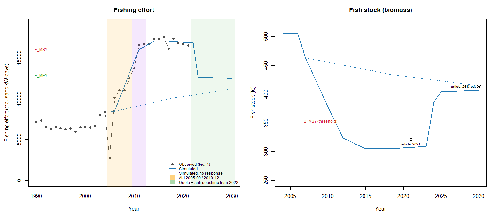

# iDPSIR

[](https://gfonseca-unifesp.github.io/iDPSIR/)

**From DPSIR diagram to management decision.** iDPSIR is an open R/Shiny application
that tests whether management responses are *sufficient* on a
Driver–Pressure–State–Impact–Response (DPSIR) causal network. It runs locally in R or
entirely in the browser, with no installation.

Most DPSIR networks start as diagrams drawn from expert knowledge, with no measured link
strengths. iDPSIR is built for that starting point. With structure and signs alone it
already answers, for each Impact:
- whether the planned responses, at the strength at which they are actually
  implemented, neutralize the worsening the pressures cause;
- how confident that answer is;
- which Impact deserves priority, and how stable that order is;
- when each response must act.

It then tells you where data would most likely change the answer, and lets you add them
link by link, keeping the source of every value.

The application follows a **seven-step workflow**, an adaptive cycle from a diagram to a
tested decision ([below](#the-workflow-in-seven-steps)). Every gap the network reveals
(a link without evidence, an Impact no response reaches, a verdict close to
neutralization) is reported as a monitoring or data need.

New to iDPSIR? The [getting-started tutorial](docs/tutorial.html) walks through every
screen with the example networks. It is also one click away from inside the app (the
"Help" link, top right).

## How to run

**In the browser:** [try it live](https://gfonseca-unifesp.github.io/iDPSIR/). The same
app runs entirely in your browser via WebAssembly ([shinylive](https://shinylive.io/)),
with no server involved. The first load takes a while, because R and its packages
download into the browser; after that it is instant. It is good for a quick look. For
real work, run it locally, so nothing depends on your connection.

**Locally:** requires R ≥ 4.1 (tested on 4.5.1). Missing packages are installed
automatically on the first run. From the project root:

```r
shiny::runApp()
```

Or, without cloning the repository:

```r
shiny::runGitHub("iDPSIR", "gfonseca-unifesp", "main")
```

## The workflow in seven steps

The steps are in the order a team usually meets them, but any step can send the team
back to an earlier one. Steps 1–5 and 7 run entirely in the application. Part of step 6,
the statistical tests against observed series, runs outside it, in R scripts that read
the same saved network and use the same engine
([Testing a network against observed data](#testing-a-network-against-observed-data-outside-the-app)).

| Step | Question | What iDPSIR shows | For decision and monitoring |
|---|---|---|---|
| 1. Frame the question | Which Impacts, responses, time unit and values? | Schema with custom levels; Impact classes and values (swing weights) | Defines what "sufficient" means; who set the values is recorded |
| 2. Draw structure and signs | How does the problem work, and on what evidence? | Validation of signs and connections; source and evidence type per link; runaway loops blocked | Undocumented links are flagged as knowledge to obtain |
| 3. Read the first run | What does the structure alone already decide? | Reach of each response; Impacts no response reaches; sufficiency, confidence, tight verdicts | Unreached Impacts are a management gap; tight verdicts set data priorities |
| 4. Build alternatives | What if a contested link is wrong? | Saved variants compared; resampling with weakly supported links absent | Robust conclusions guide action; fragile ones define research |
| 5. Search for data | Where would data change the decision? | The ranked **Data needs** table (CSV) | A ranked list of what to measure or look up |
| 6. Parameterize and test | Does the network reproduce what was observed? | In the app: comparison with the first run, levels in real units. Outside: fit to series, out-of-sample prediction, rival networks | Consistency (agreement with another model) kept apart from validation (agreement with data) |
| 7. Decide, monitor, return | Which response, how strong, which Impact first, when? | Sufficiency with confidence; priority with stability; timing; report and savepoint | What remains uncertain becomes the next monitoring programme |

**Why this order.** In a pre-registered experiment with 1,000 simulated DPSIR networks
([below](#how-general-1000-simulated-networks)), the bare structure decided about five
of every six sufficiency verdicts:
- link strengths and State thresholds each changed about one in six;
- growth trends changed about one in twenty-five;
- changes concentrated in verdicts close to neutralization.

So: read the first run; look first for the critical levels of States and the links behind
tight verdicts; use growth mainly to time a response; check the stability of a priority
order before acting on it.

## What you enter

Only two things are required: the **factors**, each with its DPSIR level, and the
**links**, each with its **sign**. Everything else has a default, and the application
says how many links rely on one.

| Item | Default | What it changes |
|---|---|---|
| Link strength: a class (weak 0.15 / moderate 0.45 / strong 0.80), a β, or r² (with n for the band) | moderate | How far a push travels |
| Uncertainty band of a link | the class band (0–0.30 / 0.30–0.60 / 0.60–1.00) | Confidence of every verdict |
| Evidence type and reference of a link | blank (counts as expert judgement) | Traceability; how often the link may be absent under structural uncertainty |
| Self-regulation of a factor (share of a deviation that fades per window) | 0.5 | Temporal reading only |
| Growth rate and cap of a factor | none | Temporal reading only (when a response stops being enough) |
| Reference level and SD of a factor | none (pushes in SD) | Pushes, thresholds and temporal levels in real units |
| Threshold of a State (critical level, in its units) | none (always on) | Whether the State passes its effects on |
| Impact class and value v | ecological, v = 1 | Priority |
| Scenario: pushed factors and strengths (100% = 1 SD, up to 500%); mode (every window, once, or a period) | — / every window | Everything downstream |

The tutorial and [Data format](#data-format) below describe every field. Supplement S6
of the accompanying paper explains each input and result in plain terms, with examples
from the three cases.

## What you get

| Result | The question it answers |
|---|---|
| **Reach** (topological and effective) | Which factors and Impacts can a response influence at all? Which Impacts does no response reach? |
| **Worsening, mitigation, net, verdict** | Does the response neutralize the worsening of each Impact (net ≤ 0)? |
| **Strength needed** | How many times stronger would the response need to be? |
| **Confidence** (100 or 300 draws, fixed seed; optionally with structural uncertainty) | In what share of resampled networks does the verdict hold? |
| **Holds for self-regulation 0.25–1** | Does the static verdict depend on how fast deviations fade? |
| **State triggers** | Is a State's threshold crossed with the pressure alone, and does the response close it? |
| **Priority and rank stability** | Which Impact first (value × effect × reliability × share uncovered), and does the order survive ±20% in the values? |
| **Temporal simulation** | When is each Impact neutralized, and does the neutralization last? |
| **Interpretation** | The same results in plain language: the status of each Impact, tight verdicts with the links to check, a coverage chart, scenarios side by side |
| **Data needs** | What to measure or look up first, ranked by how likely it is to change a verdict |
| **Strength and confidence of the network** | Where the strengths come from, how much each factor's variation the network explains, loop amplification, how uncertain the end-to-end effects are |
| **Report and savepoint** | A self-contained HTML record of the network, its sources, scenarios, parameters and seed; one portable file that reproduces every number |

Presentation conventions, not part of the model:
- *reliable*: confidence ≥ 80%;
- *fragile*: confidence 20–80%;
- *tight verdict*: net within 20% of the worsening;
- *unstable top priority*: the top Impact stays first in fewer than 80% of the variations.

Every chart, and the network drawn for print, downloads with **Download figure…**:
- format: PNG or TIFF at 150, 300 or 600 dpi, or PDF or SVG;
- width: 90, 140 or 190 mm, or any width;
- font size: in points as printed.

The network figure can be drawn in columns by DPSIR level or on a circle, with radial
labels outside. Links go in colour, or by line type for black and white printing:
- solid with an arrowhead → increases its target;
- dashed ending in a bar ⊣ decreases it;
- width shows the strength class.

## Example networks

Every example loads from the wizard's Start step (Load savepoint). The three cases of the
paper also have plain CSV tables. The tutorial's
[Example networks](docs/tutorial.html#examples) section walks through each one with its
numbers.

- **A hypothetical port**: 15 factors, 20 links, one window per season.
  [`docs/example_port.idpsir.json`](docs/example_port.idpsir.json), or
  [`data/port_nodes.csv`](data/port_nodes.csv) / [`data/port_edges.csv`](data/port_edges.csv);
  built by [`data-raw/port_build.R`](data-raw/port_build.R).
  - **The problem:** dredging clouds the water (fauna behaviour, primary production),
    and the cargo terminal's runoff carries metals (seafood contamination, water-quality
    class).
  - **The network:** every strength is a class, and the Impact values are illustrative
    swing weights.
  - **What it shows:** priority points to one response at a time, runoff treatment
    first and then a work window for the dredging campaign. The temporal reading shows
    the window is needed only during the campaign, while the treatment must start early,
    because the biota accumulates metals.
  - **Data needs:** the list starts with terminal → runoff and treatment → runoff, then
    the thresholds of turbidity, Zn and Cu.
  - Four saved scenarios.
- **Kenyan reef fishery (Mangi et al. 2007)**: 22 factors, 33 links, rebuilt from the
  indicators of the original study (*Ocean & Coastal Management* 50, 463–480).
  [`docs/example_mangi.idpsir.json`](docs/example_mangi.idpsir.json), or
  [`data/mangi2007_nodes.csv`](data/mangi2007_nodes.csv) /
  [`data/mangi2007_edges.csv`](data/mangi2007_edges.csv); built by
  [`data-raw/mangi2007_build.R`](data-raw/mangi2007_build.R).
  - **The network:** every link cites the article's section, and every strength is a
    class. The only number is the 3.7%/yr population growth.
  - **Monitoring rule:** no two indicators in one causal chain. The urchin story is one
    State, sea-urchin density, fed by its own Pressure, triggerfish fishing.
  - **What it shows:** the 2007 measures neutralize nothing, even as written. Only full
    compliance neutralizes all three Impacts, for about two decades, until population
    growth overtakes it. The gap is compliance, not the choice of measures.
  - Four saved scenarios.
- **Sri Lankan small-scale fishery (Gnanapragasam et al. 2026)**: 17 factors, 20 links,
  one window per year from 2004, parameterized from the paper's own data
  ([how](#sri-lanka-example-how-it-was-parametrized)); *Marine Policy* 189, 107095.
  [`docs/example_gnanapragasam.idpsir.json`](docs/example_gnanapragasam.idpsir.json), or
  [`data/gnanapragasam2026_nodes.csv`](data/gnanapragasam2026_nodes.csv) /
  [`data/gnanapragasam2026_edges.csv`](data/gnanapragasam2026_edges.csv).
  - **What it shows:** post-disaster aid restored fishers' income. Through the boats it
    bought, it also pushed effort up and the stock below B_MSY in 2012. The effort quota
    from 2022 brings the stock back.
  - **First run vs parameterized:** the defaults give the optimistic answer, and the
    paper's parameters reverse it.
- **First run (defaults only)**:
  [`docs/example_mangi_default.idpsir.json`](docs/example_mangi_default.idpsir.json) and
  [`docs/example_gnanapragasam_default.idpsir.json`](docs/example_gnanapragasam_default.idpsir.json),
  built by [`data-raw/first_run_build.R`](data-raw/first_run_build.R).
  - **What they are:** the same networks with every setting at its default (every link
    moderate, self-regulation 0.5, no growth or thresholds).
  - **What they show:** what the structure alone decides. For Kenya the verdicts and the
    priority agree with the full network. For Sri Lanka the Data needs table of the
    first run already puts the stock threshold first, and that is the parameter that
    reverses the answer.
- **Alternative network (step 4)**:
  [`docs/example_gnanapragasam_noaidfleet.idpsir.json`](docs/example_gnanapragasam_noaidfleet.idpsir.json),
  built by [`data-raw/gnanapragasam2026_variant_build.R`](data-raw/gnanapragasam2026_variant_build.R).
  - **What it is:** the Sri Lanka network without the two aid → fleet capacity links.
  - **What it shows:** the aid then reaches only income loss, and the stock never falls
    below B_MSY. The observed effort rejects this variant
    ([tested outside the app](#testing-a-network-against-observed-data-outside-the-app)).
- **Fisheries (orientation)**: 5 nodes and one closed feedback loop, the simplest way to
  get to know the wizard. [`docs/example_fisheries.idpsir.json`](docs/example_fisheries.idpsir.json).

### Sri Lanka example: how it was parametrized

One window is one year; window 0 is 2004, the last year before the post-tsunami aid, so
the reference values are 2004 levels. Every value below is either taken from the paper,
derived from it, calibrated against it, or — where marked — from outside it. The tables
are built by [`data-raw/gnanapragasam2026_build.R`](data-raw/gnanapragasam2026_build.R),
which also writes the savepoint; [`data-raw/gnanapragasam2026_figures.R`](data-raw/gnanapragasam2026_figures.R)
draws the figures.

- **Fishing effort** was digitized exactly from the paper's Fig. 4 (a vector figure):
  [`data/gnanapragasam2026_effort_observed.csv`](data/gnanapragasam2026_effort_observed.csv),
  7,181 thousand kW-days in 1990 to 16,531 in 2021. Its SD over that series (4,877) is
  the model unit of effort, fleet capacity and the quota — the same sample the paper's
  standardized relationships were estimated on.
- **Fish stock** comes from the paper's Gordon-Schaefer model: B_MSY = 1.5 × H_MSY =
  345 kt, so K = 690 kt and, at equilibrium, B(E) = K(1 − E/30,924), which reproduces
  the paper's Table 4. Its threshold is B_MSY itself (falling): the usual limit
  reference point, half of B_MSY (a management convention, not in the paper), was tried
  first and is never crossed at realistic levels, so the stock would never reach its
  Impacts.
- **The two aid strengths** were fitted to the observed effort, 2006–2021
  (R² = 0.93 within the fitted years; fit rewritten in
  [`analysis/validation_srilanka/calibrate.R`](analysis/validation_srilanka/calibrate.R)).
- **Self-regulation**: in the temporal simulation a link passes its strength every
  window, and a factor with self-regulation *s* settles at strength ÷ *s*. States whose
  strengths come from an equilibrium (the Schaefer stock, the motorized share) keep
  *s* = 1 so the static and temporal readings agree; the fleet, whose boats persist,
  keeps 0.02.

**Validation against data** (fit on 2006-2014, prediction of 2015-2021, rival networks) is
described in [Testing a network against observed data](#testing-a-network-against-observed-data-outside-the-app).

Consistency with the bioeconomic model: the stock falls below B_MSY in 2012 (the
paper: catch passes H_MSY in 2012) and is at 307 kt in 2021 (≈ 321 kt); with the 25%
quota from 2022, effort reaches 12,470 thousand kW-days in 2030 (E_MEY = 12,287) and
the stock 406 kt (413 kt in Table 4).



**Parameters and sources** (`data/gnanapragasam2026_parameters.csv`):

| item | value | source |
|---|---|---|
| Window length | 1 year | Annual statistics (article, 1990-2021) |
| Window 0 | 2004 | Last year before the post-tsunami aid |
| Effort SD (P1, D3, R3 units) | 4877 thousand kW-days | SD of the 1990-2021 series digitized from Fig. 4 (vector figure) |
| Effort in 2004 (reference, P1 and D3) | 8328 thousand kW-days | Fig. 4 (digitized) |
| Fishing effort -> Fish stock (beta) | -0.825 | sqrt(R2 = 0.68), CPUE vs effort (section 3.3); sign: more effort, less stock |
| Fishing effort -> Fish stock (band) | 0.622 - 1.027 | 95% interval of beta from R2 and n = 32 years |
| Carrying capacity K | 690 kt | 2 x B_MSY; B_MSY = 1.5 x H_MSY (section 3.5.1, Table 3) |
| Intrinsic growth r | 1.33 per year | 4 x H_MSY / K (Gordon-Schaefer) |
| Fish stock in 2004 (reference) | 504.4 kt | Equilibrium K (1 - E / E_max) at the 2004 effort; reproduces Table 4 |
| Fish stock SD | 108.9 kt | (K / E_max) x effort SD |
| Fish stock self-regulation | 1 | Biomass taken at its Schaefer equilibrium each year (r = 1.33/yr: recovery rate r B / K about 0.72/yr); sr = 1 keeps the temporal equilibrium equal to B(E) |
| Fish stock threshold (B_MSY) | 345.2 kt (falling) | B_MSY = 1.5 x H_MSY (article). B_lim = 0.5 B_MSY (convention) was tested and is never crossed |
| Coastal population growth | 0.8% per year | External (national statistics), not in the article |
| Coastal population in 2004 | 19.4 million | External (national statistics), not in the article |
| Per-capita demand growth | 2.3% per year | Consumption doubled over three decades (section 3.1, Fig. 5) |
| Per-capita demand ceiling | 31 kg per person | Peak of 31 kg in 2016 (section 3.1) |
| Per-capita demand in 2004 | 23.5 kg per person | 31 kg discounted at 2.3%/yr back to 2004 |
| Fleet capacity growth | 1% per year | Effort trend 1990-2004 (Fig. 4), before the aid |
| Fleet capacity self-regulation | 0.02 | Boats persist; effort stayed on a plateau after the aid (Fig. 4) |
| Post-tsunami aid -> Fleet capacity | 0.34 | Fitted with the post-war aid by least squares to Fig. 4, 2006-2021 (R2 = 0.93; a common value fits worse, R2 = 0.84) |
| Post-war aid -> Fleet capacity | 0.08 | Fitted with the post-tsunami aid (same fit) |
| Aid periods | 2005-2009 (windows 1-5); 2010-2012 (windows 6-8) | Section 3.1 and Fig. 6 |
| Fleet capacity -> Fishing effort | 0.85 (band 0.75 - 0.95) | Effort = boat power x fishing days (section 2.2.1): capacity sets effort; kept below 0.9 so the three drivers of effort explain at most 100% of its variation |
| Fleet motorization in 2004 / SD | 40% / 15.5 points | Fleet split 60:40 non-motorized before 2004, 60:40 motorized now (section 3.4); SD calibrated to that rise |
| Effort-based quota -> Fishing effort | 1 (definitional) | The quota cuts effort directly, in effort units |
| Quota size | 5% of 2021 effort = 827; 25% = 4,133 thousand kW-days | Table 4 (5% = MSY, 25% = MEY) |
| Flow factors' self-regulation | 1 (no memory) | Effort, demand, catch and income are flows, not stocks |
| Other edge strengths | classes weak 0.15 / moderate 0.45 / strong 0.80 | Qualitative links (section 3, Table 2) |

**Nodes** (`data/gnanapragasam2026_nodes.csv`, main columns):

| id | label | category | self_regulation | growth_rate | growth_cap | reference_value | sd | threshold_level |
|---|---|---|---|---|---|---|---|---|
| D1 | Coastal population | Driver | 0.50 | 0.008 |  |   19.4 |  |  |
| D2 | Per-capita fish demand | Driver | 1.00 | 0.023 | 31 |   23.5 |  |  |
| D3 | Fleet capacity (boats x power) | Driver | 0.02 | 0.01 |  | 8328.0 | 4877.0 |  |
| D4 | Indian trawler incursions | Driver | 1.00 |  |  |  |  |  |
| P1 | Fishing effort | Pressure | 1.00 |  |  | 8328.0 | 4877.0 |  |
| P2 | Illegal bottom trawling | Pressure | 1.00 |  |  |  |  |  |
| S1 | Fish stock (biomass) | State | 1.00 |  |  |  504.4 |  108.9 | 345.2 |
| S2 | Fleet motorization (% motorized) | State | 1.00 |  |  |   40.0 |   15.5 |  |
| I1 | Catch decline | Impact | 1.00 |  |  |  |  |  |
| I2 | Fisher income loss | Impact | 1.00 |  |  |  |  |  |
| I3 | Conflict with Indian fishermen | Impact | 0.50 |  |  |  |  |  |
| I4 | Traditional fishing decline | Impact | 0.50 |  |  |  |  |  |
| I5 | Loss of traditional fishing culture | Impact | 0.30 |  |  |  |  |  |
| R1 | Post-tsunami aid (2005-2009) | Response | 1.00 |  |  |  |  |  |
| R2 | Post-war aid (2010-2012) | Response | 1.00 |  |  |  |  |  |
| R3 | Effort-based quota | Response | 1.00 |  |  |  | 4877.0 |  |
| R4 | Combating poaching | Response | 1.00 |  |  |  |  |  |

**Edges** (`data/gnanapragasam2026_edges.csv`):

| link | sign | strength | band | source |
|---|---|---|---|---|
| Coastal population → Fishing effort | positive | weak |  | class |
| Per-capita fish demand → Fishing effort | positive | moderate |  | class |
| Fleet capacity (boats x power) → Fishing effort | positive | 0.850 | 0.75 – 0.95 | given |
| Indian trawler incursions → Illegal bottom trawling | positive | strong |  | class |
| Fishing effort → Fish stock (biomass) | negative | 0.825 | 0.622 – 1.027 | r2 |
| Fishing effort → Fleet motorization (% motorized) | positive | 0.750 |  | calibrated |
| Illegal bottom trawling → Fish stock (biomass) | negative | moderate |  | class |
| Fish stock (biomass) → Catch decline | negative | strong |  | class |
| Fish stock (biomass) → Fisher income loss | negative | moderate |  | class |
| Fish stock (biomass) → Conflict with Indian fishermen | negative | moderate |  | class |
| Fleet motorization (% motorized) → Catch decline | positive | moderate |  | class |
| Fleet motorization (% motorized) → Conflict with Indian fishermen | positive | weak |  | class |
| Fleet motorization (% motorized) → Traditional fishing decline | positive | strong |  | class |
| Fleet motorization (% motorized) → Loss of traditional fishing culture | positive | moderate |  | class |
| Post-tsunami aid (2005-2009) → Fleet capacity (boats x power) | positive | 0.345 |  | calibrated |
| Post-tsunami aid (2005-2009) → Fisher income loss | negative | moderate |  | class |
| Post-war aid (2010-2012) → Fleet capacity (boats x power) | positive | 0.085 |  | calibrated |
| Post-war aid (2010-2012) → Fisher income loss | negative | moderate |  | class |
| Effort-based quota → Fishing effort | negative | 1.000 | 0.9 – 1 | given |
| Combating poaching → Indian trawler incursions | negative | moderate |  | class |

## Testing a network against observed data (outside the app)

Step 6 needs three statistical tasks that the application does not perform:
1. fitting link strengths to an observed series;
2. predicting years not used in the fit;
3. comparing alternative networks by information criteria.

They run in R scripts that read a saved network (`.idpsir.json`) and run it with the
application's own engine (`R/`). The network tested is therefore exactly the one used
for the decision, and a fitted value goes back into the app as an ordinary link
strength (evidence type *calibration*).

For the Sri Lankan case, from the repository root:

```bash
Rscript analysis/validation_srilanka/validate.R
```

```bash
Rscript analysis/validation_srilanka/variant_test.R
```

- **`calibrate.R`:** least-squares fit of the two aid → fleet strengths to the observed
  fishing effort.
- **`validate.R`:**
  - fits on 2006–2014 and predicts 2015–2021;
  - compares with persistence of the 2014 value and with the 2006–2014 trend;
  - 90% prediction band;
  - rolling origin from 2012 to 2016.
  
  Result: RMSE 559 thousand kW-days, against 632 for persistence and 5,737 for the trend.
  The band covers all seven years.
- **`variant_test.R`:** compares the published network with the variant without
  aid → fleet, and with a rival that has as many fitted parameters (the fleet's own
  growth and demand → effort fitted instead).
  - The published network is preferred by ΔAIC 67.5 and 42.4.
  - It also predicts 2015–2021 best: RMSE 559, against 6,871 and 10,867.

Outputs go to `analysis/validation_srilanka/out/`.

**Two checks, kept apart:**
- *Consistency* compares the network with another model of the same system (here, the
  paper's bioeconomic model). It shows agreement, not validity.
- *Validation* compares it with observations not used in the fit, against naive
  references and rival explanations.

The 2015–2021 test period is a plateau, so the network is described as consistent with
the observed effort out of sample, not as validated.

## How general? 1,000 simulated networks

[`analysis/sim_networks/`](analysis/sim_networks/) holds a pre-registered experiment.
The pre-registration (`PREREGISTRO.md`) was committed before any run, and its deviations
are recorded there.

**Design:**
- 1,000 plausible DPSIR networks (10–25 factors), each under 20 draws of link strengths;
- the same engine as the app;
- elements added in turn: link strengths, State thresholds, the temporal reading,
  growth trends.

| What is added | Verdicts that change (95% CI) |
|---|---|
| Link strengths (bare structure → drawn strengths) | 15.9% (15.1–16.5) |
| State thresholds | 18.9% (17.4–20.5) |
| Static → temporal reading | 17.8% (16.7–19.0) |
| Growth trends | 4.3% (3.8–4.7) |
| All of the above | 22.8% (21.9–23.8) |

**Other results:**
- Changes concentrate near neutralization (odds ratio 5.4). This is why the app flags
  tight verdicts.
- Strongly amplifying loops make a change more likely; the mere presence of a loop does
  not.
- The priority order is more sensitive than the verdicts: mean Kendall τ 0.64, and the
  top priority changed in 35% of the cases.

`Rscript analysis/sim_networks/run_all.R 1000 20` reproduces everything (about 1.5 h on
20 processes). The figures and the summary are in `analysis/sim_networks/out/`.

## The application, screen by screen

The wizard has six steps: **Start** (new project, CSV import, load a `.idpsir.json`
savepoint, or combine two or more savepoints into one) → **Model** (schema/palette,
advanced) → **Nodes** → **Edges** → **Review and build** → **Explore**, which itself
has five tabs: Graph, Scenarios, Interpretation, Metrics and Report.

- **Graph** — layered (by DPSIR category) or circular layout, filters, node/edge
  emphasis, spacing controls, and pathway highlighting (chains that follow the DPSIR
  order, ranked by their effect: the product of the signed strengths along the chain, the
  path's indirect effect in path analysis). "Color nodes by" switches
  between DPSIR category and detected community (Louvain/Walktrap/Infomap/Label
  Propagation, redrawn with edges, not bare colored dots) without leaving the tab.
  Dragging a node pins it in place (persisted in the savepoint, "Reset dragged
  positions" clears it); category/community and edge-type legends can each be
  toggled off. Any view can be saved as a named snapshot to include in the report, and
  **Download network figure…** draws the network for print (columns by level or a circle
  with radial labels; links in colour or by line type).
- **Scenarios** — build two independent "pushes": a **pressure scenario** (which
  Drivers/Pressures are worsening, and how strongly) and a **response scenario**
  (which Responses are active, and how strongly). Applying them runs the primary,
  **sufficiency** reading (`R/sufficiency.R`; the path-sum expansion converges when the
  effect matrix's spectral radius is below 1, checked when the graph is built): for each Impact, how
  much the pressure scenario worsens it, how much the response scenario mitigates (or
  worsens) it, and whether that mitigation is enough to neutralize the worsening (an
  Impact the pressure does not reach is reported as **Not affected**, not neutralized;
  all in standard deviations of each factor, 100% = a push of 1 SD; a last column says
  whether the verdict holds for self-regulation 0.25–1, the reading itself being the
  temporal equilibrium with self-regulation 1) —
  plus a confidence check (% of simulations, resampling every edge's strength within
  its uncertainty band, in which the verdict holds; one row for the scenario as set with
  the sliders, one per response alone at 100%) and an **Impact prioritization**:
  relevance = value v × importance D (the pressure's total effect on that Impact,
  relative to the most affected one — with standardized strengths this is the Levins
  equilibrium of the relevance specification) × reliability (share of simulations in
  which that effect keeps its sign), and priority = relevance × gap (the share of the
  worsening the response leaves uncovered), with a bar chart, a CSV download and a
  report section, and a **Rank stability** column (share of 500 variations - values v
  changed by up to 20%, product or weighted-sum index - in which each Impact keeps its
  rank). **Include structural uncertainty** also drops links from the resampled draws,
  more often the weaker their evidence (0.2 expert/policy/blank, 0.1 literature or
  observations, 0 for definitions, regressions, calibrations and strengths estimated
  from data). The sufficiency reading above is deliberately static and ignores
  a node's `self_regulation` on purpose — that attribute (and `growth_rate`) only
  feeds the optional temporal simulation below, never the primary verdict. **Reach**
  always shows how many factors — and how many Impacts — a response's influence can
  touch through some causal path, independent of the reading above. An optional
  **temporal simulation** disclosure (`R/temporal.R`) runs the same two scenarios
  forward window by window instead of reading a single instant — useful when a
  response might, windows later, become a new pressure itself. **Scenario to
  simulate** picks the scenario applied above or any saved one (with its own temporal
  settings), to revisit its tables and charts without re-applying it. Pressure and response
  each run as **"Added every window"** (default: the push is applied again every
  window), **"Applied once and held"** (window 1 only; the level it creates fades
  only through self-regulation) or **"For a number of windows"** (a start window and a
  duration per factor, e.g. an aid programme that ran five years). A factor's
  `growth_rate` moves its base level by itself in both runs — even when it is not in
  the scenario (on by default) — optionally up to its `growth_cap`; growth and
  self-regulation are separate (self-regulation fades the deviation the network causes,
  growth moves the base level), and an **Edge intensity by window** table (CSV) shows
  what each link out of a growing factor or a thresholded State passes on. The simulation runs **until the response neutralizes
  the Impact** (default, up to 50 windows, editable: it stops at the first window in
  which every Impact the response reaches, and that is worsened in either run, is at
  or below zero or within the tolerance below — or reports "Not neutralized within N windows"), or for a
  **fixed number of windows**; **Continue after neutralizing** keeps running N more
  windows, since with a growing trend a neutralization may not last. A table shows how each Impact changes window by window
  (the stop window highlighted), with a "Neutralized (relative)" label when the net
  value is within a tolerance of the baseline (default 5%) — "until neutralized"
  also stops there (tolerance 0 = only zero counts). An option runs the baseline
  **without any response** (ignoring Impact → Response links). A chart shows one panel
  per Impact, dashed baseline vs. solid Net, points colored by that window's Verdict,
  the neutralized zone (Net ≤ 0) shaded and the stop window marked (downloadable, and
  included in the report if selected). The key message: *what makes an
  Impact converge is the chain's self-regulation; the response mode decides the
  effort; the stop criterion says in which window the problem was solved.* It's an
  explicit short-horizon integration, not a calibrated forecast — read it for the
  *direction* of an indirect, delayed effect, not for the absolute magnitude. Save a scenario and compare
  multiple saved scenarios' reach side by side; saved scenarios are kept in the savepoint
  (their settings) and recomputed when it is loaded. The temporal simulation runs on
  **Run simulation**, and the number of resamples behind the confidence readings is
  selectable (100 or 300, the maximum, since the app computes in a single process; an
  estimate of how long "Apply scenario" will take, measured on the network and the
  computer, is shown next to it). The older equilibrium-based reading
  (loop analysis / Levins 1974 — stability check, immediate vs. equilibrium effect,
  step-by-step trajectory, robustness and self-regulation-sensitivity checks, edge
  ranking) was removed: it required a stability condition no network built by this
  app's schema can ever meet, and could silently invert a prediction's sign. Its code
  is kept in `legacy/` for reference.
- **Interpretation** — a plain-language reading of the Scenarios results for the applied
  or any saved scenario: how many worsened Impacts are neutralized, one sentence per
  Impact in priority order (neutralized, % of the worsening covered and how much
  stronger the response would have to be, not covered, worsened by the response),
  key messages (the Impact to act on first, side effects, fragile verdicts, tight verdicts with the links worth checking), a coverage
  chart, a ranked **data needs** table (what to measure or look up first: links behind tight
  verdicts, States without a threshold, assumed links, response strengths; CSV) and every
  scenario side by side. The same scenario is shown in the Scenarios
  results, the temporal simulation and this tab (one selector in each, kept in sync);
  the report opens its scenario part with the same reading.
- **Metrics** — general network metrics; **strength and confidence** of the network as
  a whole (link classes, explained variance, loop amplification, Driver-to-Impact total
  effects; where the strengths came from, band widths, evidence and references, expected
  absent links, sign and interval of the total effects under the link bands - also by
  transition, least founded first); centralities; and DPSIR descriptors (gaps such as
  Impacts without a Response, or Pressures not covered by one).
- **Report** — pick which sections (saved graph snapshots, metrics, centralities,
  descriptors, edge references, saved scenarios, reproducibility info — R/package
  versions and the parameters used in the stochastic analyses) go into one
  self-contained downloadable HTML report. Every report opens the same way regardless
  of what's checked: a "Report summary" (network name/author/savepoint file, plus each
  selected scenario's pressure/response definition) and a "How to read these
  results" legend (sign convention, what "neutralized" means, the Verdict color key) —
  then the decision-relevant sections (Interpretation, with the Data needs table of each
  scenario; Response sufficiency; Reach; Temporal simulation; References) in that order, with the descriptive material (graph image,
  general metrics, centralities, DPSIR descriptors) demoted to a "Network
  characterization (appendix)" section at the end. Scenarios are always listed in
  ascending order regardless of the order they were selected in. A figure-quality option
  (screen 96 dpi or print 300 dpi) applies to every figure, and the print drawing of the
  network can be included.

## Data format

**Nodes** (`data/sample_nodes.csv`): `id`, `label`, `dpsir_category` (Driver, Pressure,
State, Impact, Response), `subsystem` (optional grouping, used to filter the graph),
`self_regulation` (optional, a number in [0, 1],
default 0.5 — the share of a factor's deviation that fades by itself each time window;
only used by the optional temporal simulation, see [Self-regulation](#self-regulation)
below), `growth_rate` (optional, default 0, greater than −1 — how the factor's
base level moves by itself per time window, e.g. population growth, independent of any
edge; only used by the temporal simulation), `growth_cap` (optional — the level, in
the factor's own units, where that growth stops, e.g. a licence cap), `reference_value` (optional — the factor's initial level in its own units),
`sd` (optional — its typical variation, a standard deviation in the same units; the
node form also accepts a coefficient of variation), `threshold_level` (optional, State
only, blank for most — the level in the factor's own units at which ALL of its outgoing
edges switch on together; see [State triggers](#state-triggers)),
`threshold_direction` (optional: `auto`, the default, reads the direction from the
initial level; `both` counts a move of that size either way), `descriptor` (optional
free-text description of what the factor represents — documentation only, not read by
any calculation), `endpoint_class` (Impact only, optional: `ecological` — the default —,
`service` or `welfare`) and `value_v` (Impact only, optional, 0–1: the social value of a
service/welfare Impact, set by hand or with "Elicit values (swing weights)" on the Nodes
step; always 1 for an ecological Impact). `interaction_type` also accepts the vocabulary
of the relevance specification (increases/triggers/improves/sustains → positive,
reduces/mitigates/decreases → negative).

Older files may carry `uncertainty` and `controllability` columns: they were removed
because they never entered any calculation (the uncertainty that matters is each edge's
strength band), and are ignored on load with a note.

**Edges** (`data/sample_edges.csv`): `from`, `to`, `interaction_type` (positive/negative
— required: the sign has no default), `weight` (the edge's **strength** as a
standardized path coefficient beta: how many standard deviations the target moves when
the source moves by one), `weight_low`/`weight_high` (optional uncertainty band of the
strength), `strength_class` (optional: `weak`, `moderate`, `strong`), `evidence_type`,
`reference` (optional DOI/URL/citation backing the link, listed in the report if
included).

**What you need to enter.** Only the structure (nodes with their category, edges) and
the sign of each edge are required — everything else has a default, and the network
runs with them (results are then qualitative; the Review step and the report say how
many edges rely on a default). Fields in the same group replace each other — fill in
one:

| Group | Fill in one of (priority order) | Default |
|---|---|---|
| Strength of an edge | beta directly > r-squared (the form converts it: \|beta\| = sqrt(r²)) > class | Moderate |
| Uncertainty of an edge | `weight_low`/`weight_high` > r-squared plus sample size n (band from the standard error) > band of the class | band of the class |

| Class | Strength used | Uncertainty band |
|---|---|---|
| Weak | 0.15 | 0 – 0.3 |
| Moderate (default) | 0.45 | 0.3 – 0.6 |
| Strong | 0.80 | 0.6 – 1.0 |

The effect of a scenario is the product of the strengths along each causal path,
summed over paths, so a response far from an Impact is naturally attenuated. The
network is blocked at "Build" if its feedback loops would amplify without bound
(spectral radius of the strength matrix at or above 1); the message names the edges on
the loop. **Older files** (savepoints and CSVs from before standardized strengths) are
converted on load (tick "Convert from older relative weights" for a CSV) so that their
static results stay exactly the same; the Start step reports the conversion.

**Default DPSIR connections:** Driver→Pressure, Pressure→State, State→Impact,
Impact→Response, and Response→{Driver, Pressure, State, Impact}. The schema is
configurable, so this order and vocabulary can be adjusted per project.

**Modeling convention — State nodes are neutral measurements**, e.g. `Fish stock`,
`Coral cover`, not `Fish stock decline`/`Coral degradation`. The direction (is more of
it good or bad) belongs on the edges (`interaction_type`), not baked into the node's
name — naming a State after the problem it's usually associated with quietly assumes
a sign that can drift out of sync with the actual edges. All the example networks
follow this (with one documented, internally-consistent exception in the
Gnanapragasam network). The app never checks this for you — see the tutorial's
[Modeling convention](docs/tutorial.html#conventions) section for the full sign table,
the golden rule that keeps a node's edges consistent, and how to read the temporal
simulation's Verdict once your signs are in place.

### Self-regulation

`self_regulation` (0–1, default 0.5) is the share of a factor's deviation that fades by
itself each window, independently of the network: 0 = nothing fades and everything
that arrives accumulates (a stock with no replenishment, a persistent contaminant);
0.3 = 30% of the deviation fades each window (a population rebuilding, a habitat
regenerating); 1 = no memory, the factor only reflects what arrives in the current
window.

Each window: *new value = (1 − self_regulation) × previous value + what arrives through
the edges + the push*.

Example — fishing effort (P) → fish stock (S) → catch decline (I), with strengths 0.7
and 0.6 (both negative) and a pressure of 1 standard deviation:

| Case | Window 2 | 4 | 8 | 12 |
|---|---|---|---|---|
| Ongoing pressure, self-regulation 0 everywhere — fish stock | −0.70 | −4.20 | −19.6 | −46.2 |
| Ongoing pressure, stock recovers 30% per window — fish stock | −0.70 | −1.53 | −2.14 | −2.29 (settles at −0.7 ÷ 0.3 = −2.33) |
| Ongoing pressure, self-regulation 1 everywhere — fish stock | −0.70 | −0.70 | −0.70 | −0.70 (same as the static reading) |
| One-off pressure, stock recovers 30% per window — fish stock | −0.70 | −0.34 | −0.08 | −0.02 (back to normal) |

Under a constant load, a factor settles at *load ÷ self-regulation*: a contaminant with
self-regulation 0.05 accumulates up to 20 times what arrives each window, which is how
a small per-window pressure can still cross a threshold through accumulation.

| Self-regulation | Half-life of recovery | Build-up at equilibrium (1 ÷ self-regulation) | Typical of |
|---|---|---|---|
| 0.05 | 13.5 windows | 20× | contaminant in sediment |
| 0.10 | 6.6 windows | 10× | reef recovery, long-lived species |
| 0.30 | 1.9 windows | 3× | short-cycle fish stock |
| 0.50 (default) | 1 window | 2× | water quality that renews quickly |
| 1 | — | 1× | monthly income, catch in the window |

### State triggers

A State with a threshold passes its effect on only once it crosses that level — a
collapse point, for example a fish stock falling below 85 t. The model works in
standard deviations: the threshold becomes *z = (threshold level − initial level) /
typical variation* (1 for either when blank), and the trigger is open when the State's
deviation has crossed *z* in its direction. It is used by both readings:

- **Sufficiency (static)** — the State's deviation under the scenario decides the gate,
  and the Scenarios tab shows a *State triggers* table: open or closed under the
  pressure alone and with the response, and whether the response closes it. An Impact
  held back by a closed trigger is reported as neutralized by the trigger, and *Reach*
  also reports what the scenario actually reaches, not crossing closed triggers.
- **Temporal simulation** — checked every window, by the *accumulated* State level
  (default) or by the *load* arriving in each window (or both, to compare). A weak but
  steady pressure may never trigger by load and still trigger by accumulation — so the
  two readings can disagree, as in the Gnanapragasam example, where the stock's trigger
  (B_MSY) stays closed in a single instant and opens by accumulation in 2012 (window 8).

Pushes are shares of one standard deviation (100% = 1 SD, up to 500%); a factor with a
typical variation also takes its push in its own units. Older files with an
`activation_threshold` fraction *f* are converted on load to a threshold level
*reference × (1 − f)* in either direction, which reproduces the old rule |x| ≥ f·reference.

## Reproducibility and testing

- **One file holds a project.** A savepoint (`.idpsir.json`) stores the network, the
  source of every link, the scenarios (the applied one and every saved one) and the
  temporal settings. You can download it from any step.
- **The report records the run.** The HTML report records the parameters, software
  versions and random seed, so the same file always reproduces the same numbers.
- **The core is tested.** The scientific core does not depend on the interface. A
  `testthat` suite checks it against:
  - hand-verified examples;
  - the three cases;
  - savepoints in older formats, which must still load with the same results.

  Run it from the project root:

  ```r
  testthat::test_dir("tests/testthat")
  ```

  or from a shell:

  ```bash
  Rscript tests/testthat.R
  ```

  `testthat` is not a runtime dependency of the app, so install it if missing.
- **Continuous integration.** The suite runs on every push and pull request (GitHub
  Actions). The online demo is rebuilt from `main` only after it passes.
- **Pinned dependencies.** `DESCRIPTION` lists the dependencies and `renv.lock` pins the
  versions used in development and CI (`renv::restore()` recreates them). Running the
  app never requires renv.
- **Every number in the paper comes from a script.** Three scripts produce what the
  accompanying paper cites:
  - `data-raw/manuscript_build.R` computes the numbers;
  - `data-raw/manuscript_tables.R` writes the tables, checked against the text;
  - `data-raw/manuscript_figures.R` draws the six figures at 600 dpi, with the same
    exporter and network drawing as the app.

  The cited numbers are frozen in `tests/testthat/fixtures/manuscript_numbers.json`, so a
  change of the engine that alters one of them fails the suite.

## Paper and supplementary material

The application accompanies the paper *From DPSIR diagram to management decision: a
guided, open software to test whether responses are sufficient (iDPSIR)* (Fonseca and
Davanso, in preparation). Its supplementary material maps onto this repository:

| Supplement | Content | In the repository |
|---|---|---|
| S1 | Port: savepoint, links, scenarios and their schedules, Data needs | `docs/example_port.idpsir.json`, `data/port_*.csv`, `data-raw/port_build.R` |
| S2 | Kenyan reef fishery: savepoints (full and first run), Data needs | `docs/example_mangi*.idpsir.json`, `data/mangi2007_*.csv`, `data-raw/mangi2007_build.R` |
| S3 | Sri Lankan fishery: savepoints (published, first run, variant), parameters and sources, observed effort | `docs/example_gnanapragasam*.idpsir.json`, `data/gnanapragasam2026_*.csv` |
| S4 | Pre-registration of the simulation experiment and its deviations | `analysis/sim_networks/` |
| S5 | Tool-search protocol, with a source for each cell of Table 1 | `analysis/tool_search/` |
| S6 | Plain-language guide to every input and result | (with the paper); see also the tutorial and [Data format](#data-format) |
| S7 | Methods run outside the app: calibration, out-of-sample validation, comparison of networks | `analysis/validation_srilanka/` |

## Limitations

- **Garbage in, garbage out.** iDPSIR compares and ranks responses given the knowledge
  encoded in the network. Its conclusions are only as good as the structure, signs and
  strengths it is given.
- **Linear propagation.** Effects add up except where a threshold intervenes. Strength
  classes are a qualitative default, not measured effects.
- **The static reading assumes full self-regulation.** It is one instant with
  self-regulation 1, and a verdict can depend on that assumption. The app reports
  whether it does.
- **The temporal reading shows dynamics, not forecasts.** It reveals delayed, indirect
  and threshold effects and how long a response holds, not absolute forecasts. Runs with
  strongly amplifying loops can diverge.
- **Thresholds are on–off switches.** Treat them as hypotheses.
- **Priority is the least stable output.** It depends on elicited values.
- **Structural uncertainty covers only drawn links.** It is the possible absence of
  links that were drawn, not links nobody drew.
- **Fitting, validation and comparison need R.** They run outside the app, in R scripts
  (see above).
- **No user testing.** The app has not been tested with users; its accessibility is a
  design property, not a measured one.
- **No orientation check.** The app does not infer whether more of a factor is better
  or worse (see the modeling convention below).

## Repository structure

```
iDPSIR/
├── app.R, global.R            # entry point; global.R installs missing packages and source()s every file (order matters)
├── R/                         # scientific core, independent of the interface
│   ├── schema.R               # configurable schema: levels, order, roles, palettes, evidence types
│   ├── validate.R             # import checks and normalization of nodes and links
│   ├── structural.R           # links as standardized path coefficients (beta) with bands; classes; rho(B) < 1 check; structural uncertainty
│   ├── sufficiency.R          # static reading: total effects, worsening / mitigation / net, confidence by resampling
│   ├── triggers.R             # State thresholds (gates), static and temporal
│   ├── relevance.R            # Impact relevance, priority and rank stability
│   ├── temporal.R             # window-by-window simulation: modes, growth, self-regulation, stop rules
│   ├── interpretation.R       # plain-language reading, tight verdicts, coverage chart, scenario comparison
│   ├── data_needs.R           # the ranked Data needs table (step 5)
│   ├── metrics.R              # network metrics, strength and confidence of the network, DPSIR descriptors
│   ├── reach.R, pathways.R    # reach of a response; causal pathways along the DPSIR order
│   ├── graph.R                # igraph builder and interactive visualization
│   ├── figure_export.R        # every figure in the chosen format, size, dpi and font; the network drawn for print
│   ├── scenario_plots.R       # temporal, priority and rank-stability charts
│   ├── report.R, io.R         # HTML report; CSV import and .idpsir.json savepoints
│   ├── loop_analysis.R, responses.R
│   └── modules/               # Shiny modules: wizard, data steps, Graph, Scenarios + Interpretation, Metrics, Report
├── data/                      # example networks as CSV, Sri Lanka parameters and observed effort
├── data-raw/                  # scripts that build the examples and their first-run versions, the Sri Lanka variant,
│                              #   and every number, table and figure of the paper (manuscript_*.R)
├── docs/                      # tutorial.html, example savepoints, example figures, CHANGELOG.md
├── analysis/
│   ├── validation_srilanka/   # calibration, out-of-sample validation, rival networks (outside the app)
│   ├── sim_networks/          # pre-registered experiment with 1,000 simulated networks
│   └── tool_search/           # documented search of existing tools (Table 1 of the paper)
├── tests/testthat/            # test suite; fixtures/ holds older-format savepoints and the frozen paper numbers
├── legacy/                    # code no longer used (older equilibrium engine), kept for reference
├── DESCRIPTION, renv.lock     # dependencies and pinned versions (development and CI)
└── LICENSE, CITATION.cff
```

## License and citation

MIT (see [`LICENSE`](LICENSE)). Authors: Gustavo Fonseca and Marcela Bergo Davanso
(Instituto do Mar, Universidade Federal de São Paulo, UNIFESP). To cite iDPSIR, use
[`CITATION.cff`](CITATION.cff) (GitHub shows it under "Cite this repository").
